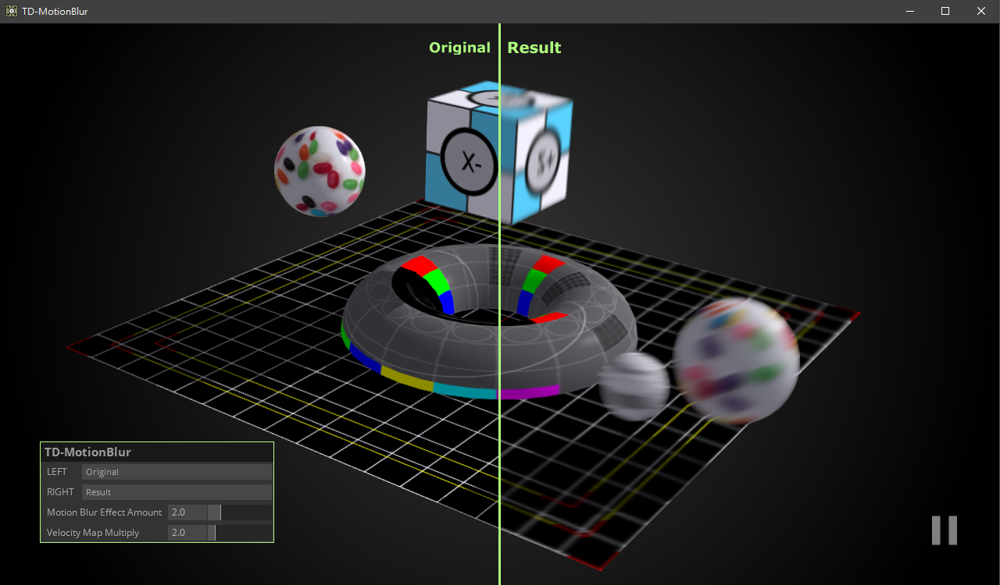

# TD-MotionBlur
An Easy-to-use Motion Blur component in TouchDesigner, work in progress.

The implementation of this component is based on this [article](http://john-chapman-graphics.blogspot.com/2013/01/per-object-motion-blur.html).

Use the new function `Custom Attributes instances` after TD build 2020.20000 to pass the object matrix of the previous frame to individual objects, and then use a single Render Pass and a single GLSL MAT to calculate the Velocity Buffer of the objects, so users do not need to customize GLSL MAT to change the appearance of objects.

**Disadvantages :** Alpha texture and Displacement texture that change the shape of objects cannot be used in Velocity Buffer.

## To do
- Sampling weights based on depth buffer.
- Take a different process for the instantiated object COMP.
- Other kinds of MotionBlur implementation.

## Author

Yea Chen (yeataro)

https://github.com/yeataro

yeataro@gmail.com